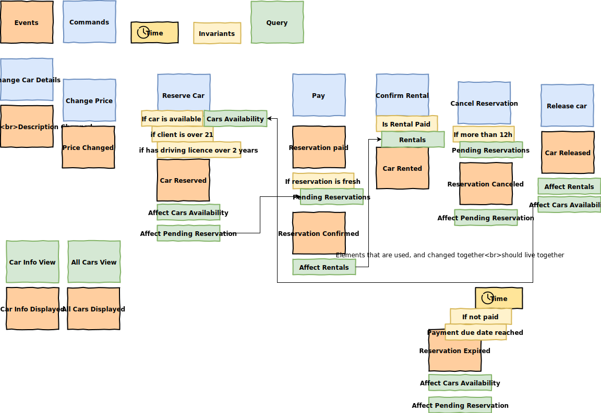

Sample car rental application
=============================

Assumptions:
1. To use event storming as knowledge extraction tool
2. Describe expected behaviours of modules with tests
3. Map extracted design to source code
4. Find out props and cons of architecture styles for different module requirements
5. Find out props and cons of testing approach for different module requirements 

What should i care?
===================

1. You will find out fully working application
2. Integration of different architecture approaches
3. Cross-cutting approach to tests 
    * units
    * integration
    * functional

First Event Storming session
============================
* events
* commands
* invariants
* relations

Continue reading:
1. [Development](docs/development.md)

Inspired by article:

https://spring.io/blog/2018/04/11/event-storming-and-spring-with-a-splash-of-ddd